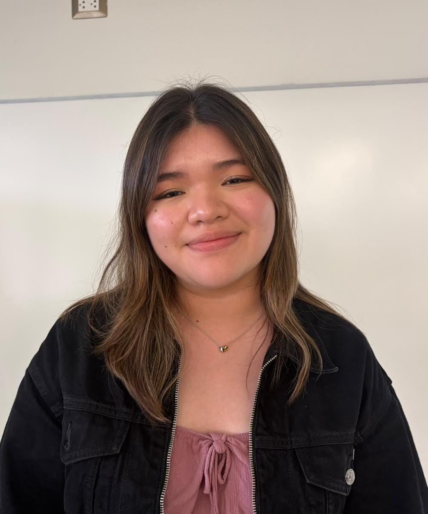
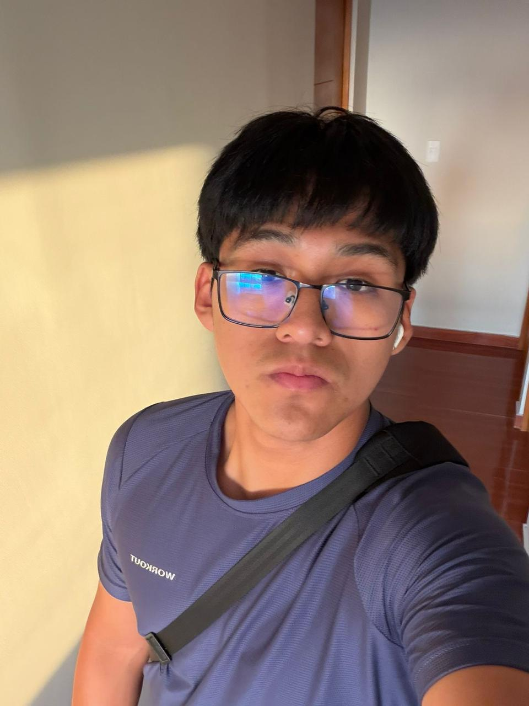
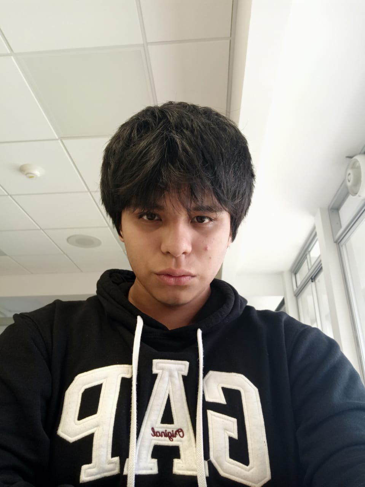

# Equipo 11 - Fundamentos de Biodiseño
### Carrera de Ingeniería Biomédica
#### Universidad Peruana Cayetano Heredia
---
## 🌍 Descripción del Equipo
Somos el Equipo 11 del curso Fundamentos de Biodiseño 2026-2, conformado por estudiantes de la carrera de Ingeniería Biomédica.
Nuestro objetivo es aplicar la metodología de diseño para generar soluciones innovadoras con impacto social, tecnológico y ambiental.

Nos interesa trabajar en los siguientes Objetivos de Desarrollo Sostenible (ODS):

- ODS 3: Salud y Bienestar
- ODS 6: Agua Limpia y Saneamiento
- ODS 9: Industria, Innovación e Infraestructura
- ODS 11: Ciudades y Comunidades Sostenibles
- ODS 13: Acción por el Clima
---
## 📸 Fotografía del Equipo

##### *Figura 1. Fotografía del equipo 11*
 
---
## 👥 Integrantes del Equipo

| Foto | Nombre | Rol | Intereses |
| ---- | ------ | --- | --------- |
|  | HUIDOBRO KOKUBUN, MIRANDA NAOMI | Líder del equipo | Innovación social, sostenibilidad |
|  | ARANA OCROS, CHRISTIAN JESUS | Responsable de investigación | Gestión ambiental, desarrollo comunitario |
| F3 | BRAVO LARICO, JUAN PABLO RAI | Diseñador/a | Diseño de prototipos, creatividad aplicada |
| F4 | BASTIDAS REYES, MARIANGEL BEATRIZ | Encargado/a de documentación | Comunicación científica, redacción técnica |
|  | AUQUI JOTA, LUCIANO MATEO ALEJANDRO | Programador/a - Modelador/a | Programación, análisis de datos, simulación |
|  | CRISOLOGO RAMIREZ, RENATO DEL PIERO | Programador/a - Modelador/ao | Programación, análisis de datos, simulación |

---
## 📌 Resumen Final
Este README resume quiénes somos, qué nos motiva y en qué ODS queremos enfocar nuestro trabajo durante el curso.
